# PDFormer
The code for "PDFormer: A Multimodal Transformer for Quantifying Motor Symptom Severity in Parkinson’s Disease" is coming.
<table>
  Examples of finger-tapping sequences from the PDMotorDB dataset. The labeled scores are taken directly from the original records in the dataset.
  <tr>
    <td align="center">
       
      <b>Finger Tapping (Score 0)</b>
    </td>
    <td align="center">
      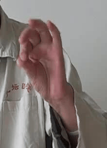 
      <b>Finger Tapping (Score 1)</b>
    </td>
    <td align="center">
      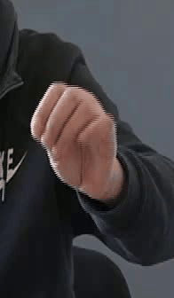 
      <b>Finger Tapping (Score 2)</b>
    </td>
    <td align="center">
      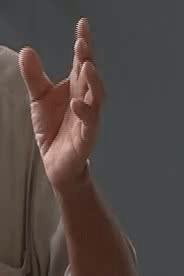 
      <b>Finger Tapping (Score 3)</b>
    </td>
  </tr>
  <tr>
    <td align="center">
       
      <b>3D skeleton motion (Score 0)</b>
    </td>
    <td align="center">
       
      <b>3D skeleton motion (Score 1)</b>
    </td>
      <td align="center">
       
      <b>3D skeleton motion (Score 2)</b>
    </td>
    </td>
      <td align="center">
       
      <b>3D skeleton motion (Score 3)</b>
    </td>
  </tr>
  <tr>
    <td align="center">
      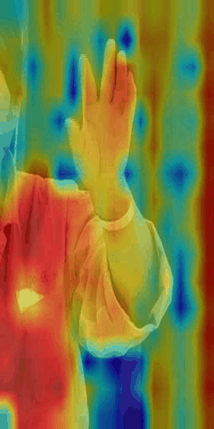 
      <b>Dinov2 motion (Score 0)</b>
    </td>
    <td align="center">
      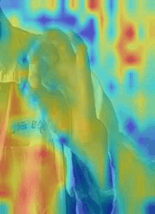 
      <b>Dinov2 motion (Score 1)</b>
    </td>
      <td align="center">
      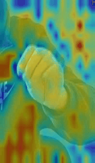 
      <b>Dinov2 motion (Score 2)</b>
    </td>
    </td>
      <td align="center">
      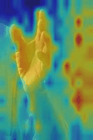 
      <b>Dinov2 motion (Score 3)</b>
    </td>
  </tr>
</table>
<table>
  Examples of 3D hand pose estimations for detecting motor symptoms in the hands.
  <tr>
    <td align="center">
      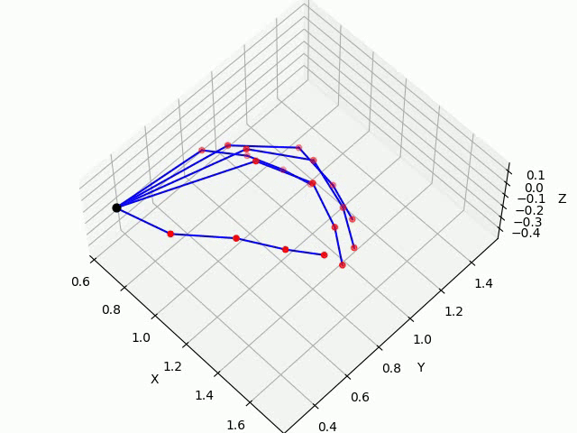 
      <b>Finger Tapping</b>
    </td>
    <td align="center">
      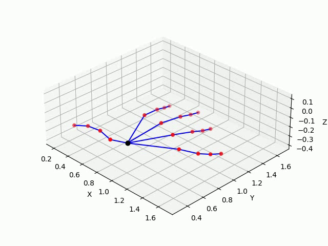 
      <b>Hand Movements</b>
    </td>
  </tr>
  <tr>
    <td align="center">
      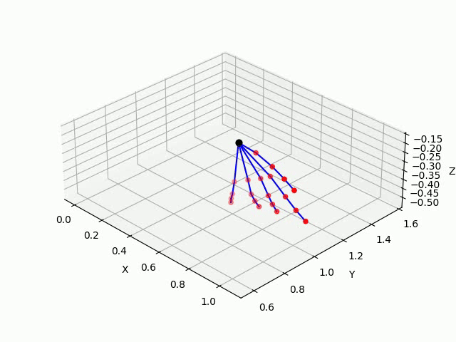 
      <b>Pronation-Supination</b>
    </td>
    <td align="center">
      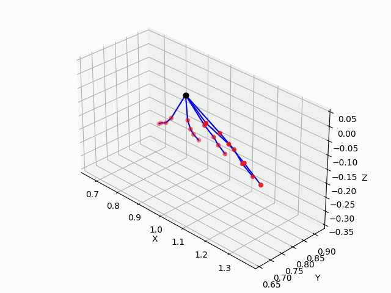 
      <b>Postural Tremor</b>
    </td>
      <td align="center">
      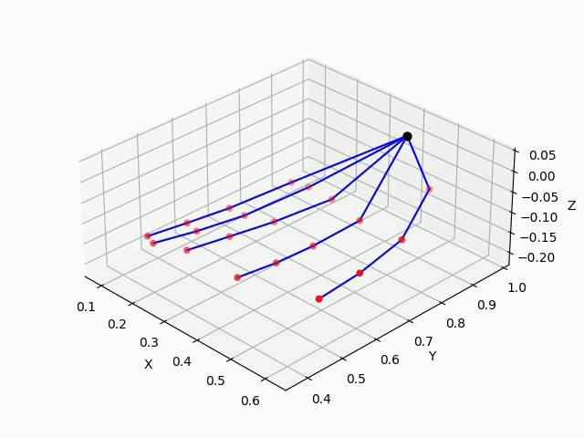 
      <b>Rest Tremor (hand)</b>
    </td>
  </tr>
</table>
<table>
  Examples of 3D whole-body pose estimations for detecting motor symptoms.
  <tr>
    <td align="center">
      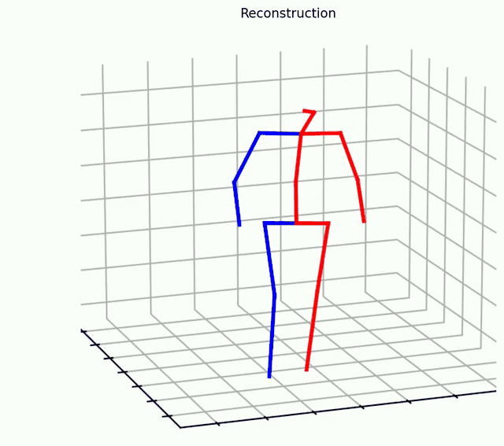 
      <b>Gait</b>
    </td>
    <td align="center">
       
      <b>Gait</b>
    </td>
    <td align="center">
       
      <b>Freezing of Gait</b>
    </td>
  </tr>
</table>
<table>
  Examples of 2D pose estimation for half-body and multi-person motor symptom assessment, such as Leg agility or Postural Stability.
  <tr>
    <td align="center">
      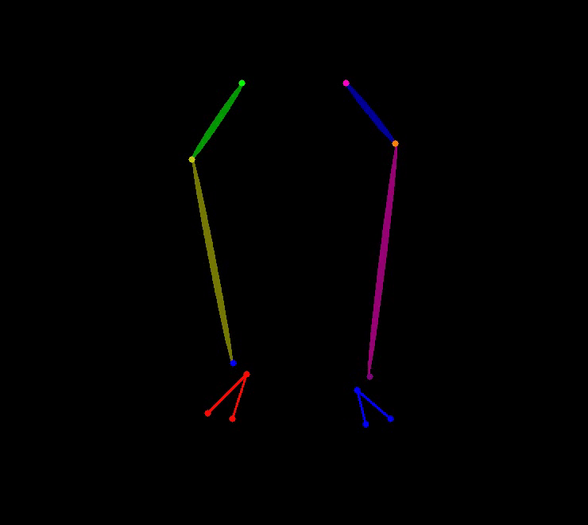 
      <b>Leg agility</b>
    <td align="center">
      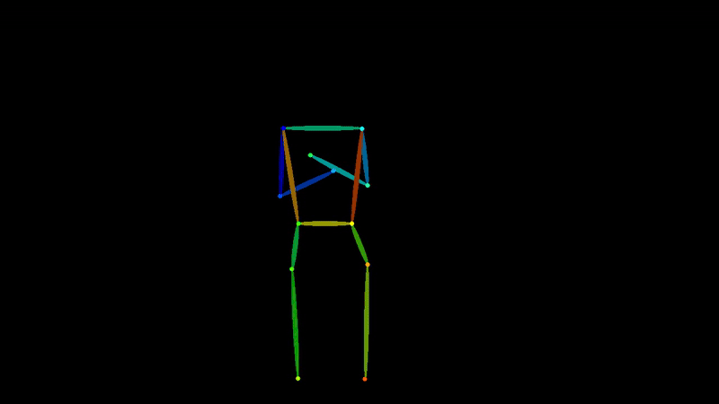 
      <b>Arising from Chair</b>
    <td align="center">
      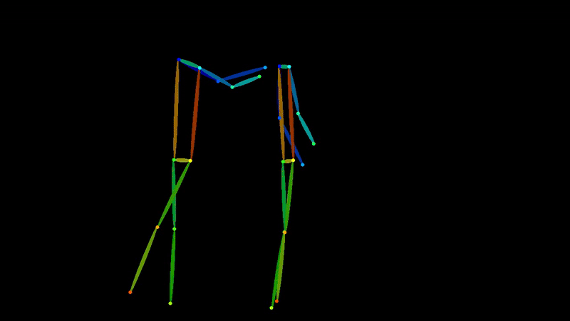 
      <b>Postural Stability</b>
    </td>
  </tr>
</table>
<table>
  Examples of DinoV2 motion features for other motor symptoms.
  <tr>
    <td align="center">
       
      <b>Leg agility</b>
    <td align="center">
       
      <b>Arising from Chair</b>
    <td align="center">
       
      <b>Rest tremor</b>
    </td>
    <td align="center">
       
      <b>Postural tremor</b>
    </td>
    <td align="center">
       
      <b>Kinetic tremor</b>
    </td>
    <td align="center">
       
      <b>Pronation-supination</b>
    </td>
  </tr>
</table>
